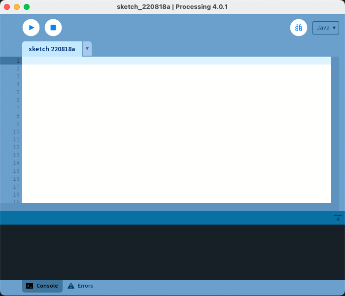

# Processing の環境構築

## 準備

[公式サイト](https://processing.org/) で Processing をダウンロードしましょう。

ダウンロードが成功したら起動して画面を眺めてみましょう。



左上の "▷" ボタンを押して実行してみましょう。もう一つウィンドウが開いたら成功です。左上の "□" ボタンを押すと停止することができます。

## 標準ログ出力

以下のコードを書いて実行してみましょう。

```java
println("Hello, Processing!");
```

[`println()`](https://processing.org/reference/println_.html) 関数は，コンソールにログを出力する関数です。

## `setup()` と `draw()`

Processing で最も重要な 2 つの関数は [`setup()`](https://processing.org/reference/setup_.html) と [`draw()`](https://processing.org/reference/draw_.html) です。

以下のコードを実行してみましょう。`setup()` 関数はプログラムが開始するときに 1 回だけ実行される関数です。 [`size()`](https://processing.org/reference/size_.html) 関数には Processing で描画する絵の表示領域を指定します。

```java
void setup() {
  size(500, 500);
}
```

次に，以下のような `draw()` 関数を追加して実行してみて下さい。

```java
void setup() {
  size(500, 500);
}

void draw() {
  circle(mouseX, mouseY, 10);
}
```

`setup()` が 1 回だけ実行されるのに対し，`draw()` 関数は繰り返し実行されます。

Processing にはたくさんの関数が用意されています。[リファレンス](https://processing.org/reference/)を眺めてみましょう。

次回以降，様々な関数を組み合わせてビジュアルコーディングの技法を学んでいきます。
