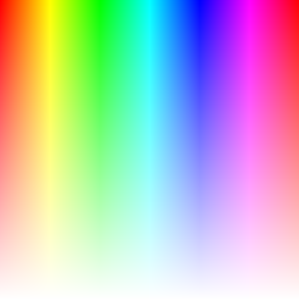
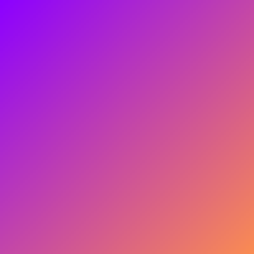

# 色

私たちは，様々な物体に反射したり吸収されたりする光を知覚して色を感じています。これから，色の基礎知識について簡単に説明します。そのあとで，スクリーンを通じてその色を制御するプログラムをみていきます。

## RGB カラーモデル

<span style="color: red;">赤</span>・<span style="color: green;">緑</span>・<span style="color: blue;">青</span>の三色 (RGB) の組み合わせで色を表現する。テレビや PC のディスプレイなどはこの方法をベースとしている。この方法では色を組み合わせると明るくなる（加法混色）。白色を合成するための色は「光の三原色」とも呼ばれる。

## プログラムで確認する

Processing で次のコードを実行してみましょう。

```java
void setup() {
  size(500, 500);
  background(0, 0, 0);
}
```

[`background()`](https://processing.org/reference/background_.html) 関数には RGB の値を 0~255 までの整数値でそれぞれ指定します。（なぜ 255 なのかについては後ほど説明します。）

実際にそれぞれの値を変更して実行してみて下さい。

- `background(255, 0, 0);` => 赤
- `background(0, 255, 0);` => 緑
- `background(0, 0, 255);` => 青
- `background(0, 0, 0);` => 黒
- `background(255, 255, 255);` => 白
- `background(0, 255, 255);` => ？
- `background(255, 0, 255);` => ？
- `background(255, 255, 0);` => ？

## 色相

色相 (hue) は<span style="color: red;">赤</span>，<span style="color: orange;">橙</span>，<span style="color: yellow;">黄</span>，<span style="color: green;">緑</span>，<span style="color: blue;">青</span>，<span style="color: purple;">紫</span>といった色味を表します。彩度，明度と併せて**色の三属性**といわれています。

Processing には色の三属性を使って色を指定する方法が用意されています。
[`colorMode()`](https://processing.org/reference/colorMode_.html) という関数を使うと，色の指定方法を変更できます。

デフォルトでは 0~255 の RGB カラーモデルになっています。色の三属性である色相 (hue)，彩度 (saturation)，明度 (brightness) を用いた HSB カラーモデルを使ってみましょう。

```java
void setup() {
  size(500, 500);
  noStroke();
  colorMode(HSB, width, height, 100);

  int stepX = 20;
  int stepY = 20;

  for (int i = 0; i < height; i += stepY) {
    for (int j = 0; j < width; j += stepX) {
      fill(j, height - i, 100);
      rect(j, i, stepX, stepY);
    }
  }
}
```

`width` と `height` は表示領域の幅と高さをそれぞれ指し示すシステム変数です。色相の値を 0 から `width` の範囲で指定し，彩度を 0 から `height` の範囲で指定しています。



##

## 線形補間

[`lerpColor()`](https://processing.org/reference/lerpColor_.html) 関数を使うと，2 つの色の間の色を保管することができます。以下のプログラムを実行してみて下さい。

```java
color from = color(255, 0, 255);
color to = color(0, 255, 255);

void setup() {
  size(500, 500);
}

void draw() {
  float p = (float) mouseX / width;
  color c = lerpColor(from, to, p);
  background(c);
}
```

`mouseX` はマウスの x 座標にアクセスするためのシステム変数です。

### 演習問題

以下のようなグラデーションを描いてみましょう。



## 参考

- [Additive color - Wikipedia](https://en.wikipedia.org/wiki/Additive_color)
- [Subtractive color - Wikipedia](https://en.wikipedia.org/wiki/Subtractive_color)
- [RGB color model - Wikipedia](https://en.wikipedia.org/wiki/RGB_color_model)
- [Hue - Wikipedia](https://en.wikipedia.org/wiki/Hue)
