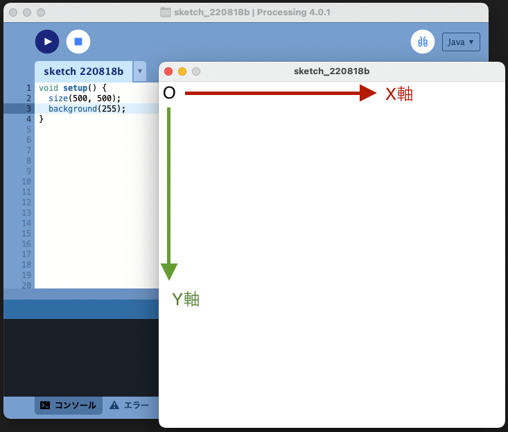

# 形

Processing で円や多角形などの様々な形を描画する方法をみていきます。

## 座標系

Processing の座標系は以下の図のようになっています。



左上が原点 `(x, y) = (0, 0)` です。X 軸が右方向に正，Y 軸が下方向に正です。

以下のプログラムを実行してみて下さい。マウスの座標値を書く（コードの意味は今理解できなくて問題ありません。）

```java
void setup() {
  size(500, 500);
  textSize(32);
  textAlign(CENTER);
  fill(0, 0, 0);
}

void draw() {
  background(255, 255, 255);
  String s = "(x, y) = (" + mouseX + ", " + mouseY + ")";
  text(s, width / 2, height / 2);
}
```

## 基本的な図形

基本的な図形の描画方法について一挙に紹介します。手元で実行してみて下さい。

### 円 - [`circle()`](https://processing.org/reference/circle_.html)

```java
void setup() {
  size(500, 500);  // キャンバスの大きさを 500 x 500に
  fill(255, 0, 0);  // 図形の色を赤にする。RGBカラーモデルを覚えていますか？
  circle(250, 250, 200);
}
```

[`fill()`](https://processing.org/reference/fill_.html) は描画する図形の色を指定する関数です。

### 楕円 - [`ellipse()`](https://processing.org/reference/ellipse_.html)

```java
void setup() {
  size(500, 500);
  fill(0, 255, 0);
  ellipse(250, 250, 200, 300);
}
```

### 正方形 - [`square()`](https://processing.org/reference/square_.html)

```java
void setup() {
  size(500, 500);
  fill(0, 0, 255);
  square(250, 250, 200);
}
```

### 長方形 - [`rect()`](https://processing.org/reference/rect_.html)

```java
void setup() {
  size(500, 500);
  fill(0, 255, 255);
  rect(100, 150, 300, 200);
}
```

### 三角形 - [`triangle()`](https://processing.org/reference/triangle_.html)

```java
void setup() {
  size(500, 500);
  fill(255, 0, 255);
  triangle(250, 125, 80, 220, 386, 275);
}
```

### 扇形 - [`arc()`](https://processing.org/reference/arc_.html)

```java
void setup() {
  size(500, 500);
  fill(255, 255, 0);
  arc(250, 250, 200, 200, PI / 4, PI * 7 / 4, PIE);
}
```

## 動かす・色や形を変える

図形のパラメータを動かしてみます。

### `frameCount` 使って，時間経過とともに大きくなる円

```java
void setup() {
  size(500, 500);
}

void draw() {
  circle(250, 250, frameCount);
}
```

### `mouseX` と `mouseY` を使ってマウスの位置に応じて大きさが変わる楕円

```java
void setup() {
  size(500, 500);
}

void draw() {
  ellipse(250, 250, mouseX, mouseY);
}
```

### `mouseX` と `mouseY` を使ってマウスの位置に応じて色が変わる円

```java
void setup() {
  size(500, 500);
  colorMode(HSB, width, height, 100);
}

void draw() {
  fill(mouseX, mouseY, 100);
  circle(250, 250, 300);
}
```

### 中心の座標に応じて色が変わる円

```java
void setup() {
  size(500, 500);
  colorMode(HSB, width, height, 100);
}

void draw() {
  float x = random(width);
  float y = random(height);
  fill(x, y, 100);
  circle(x, y, 100);
}
```

### `frameCount` 使って，時間経過とともに少しずつ移動する円（ランダムウォーク）

```java
float x = 0.0;

void setup() {
  size(500, 500);
  x = 250;
}

void draw() {
  background(0, 0, 0);
  float r = random(1);
  x = x + (r < 0.5 ? -1 : 1);
  circle(x, 250, 100);
}
```

---

残りの時間は各自色々と試してみて下さい。
