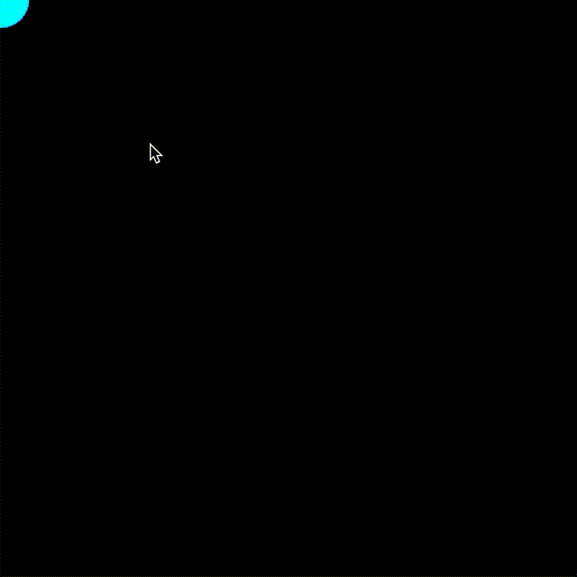

# インタラクション

マウスやキーボードなどのユーザ操作をプログラムで扱う方法を学びます。

## マウス

これまでも既に使用してきましたが， `mouseX` と `mouseY` を使うと現在のマウスの座標値にアクセスできます。

```java
void setup() {
  size(500, 500);
}

void draw() {
  background(0, 0, 0);
  circle(mouseX, mouseY, 10);
}
```

マウスがクリックされたことを検知するには [`mouseClicked()`](https://processing.org/reference/mouseClicked_.html) 関数を使います。

以下はクリックされる度にキャンバスの背景色が赤くなっていくプログラムです。

```java
int redValue = 0;

void setup() {
  size(500, 500);
}

void draw() {
  background(redValue, 0, 0);
}

void mouseClicked() {
  redValue = redValue + 10;
}
```

左クリックと右クリックを見分けることもできます。[`mouseButton`](https://processing.org/reference/mouseButton.html) というシステム変数が `LEFT` と等しければ左クリック，`RIGHT` と等しければ右クリックです。

右クリックされたときは赤い背景色を黒に近づけてみます。

```java
int redValue = 0;

void setup() {
  size(500, 500);
}

void draw() {
  background(redValue, 0, 0);
}

void mouseClicked() {
  if (mouseButton == LEFT) {
    redValue = redValue + 10;
  } else if (mouseButton == RIGHT) {
    redValue = redValue - 10;
  }
}
```

マウスクリックのイベントをもう少し詳しく検知する方法もあります。クリックが開始されたとき，離したときをそれぞれ検知したい場合は，[`mousePressed()`](https://processing.org/reference/mousePressed_.html) と [`mouseReleased()`](https://processing.org/reference/mouseReleased_.html) を使います。

以下のコードを実行してみてください。マウスクリックを押した位置と離した位置がそれぞれ取得できていることがわかります。

```java
float pressedX = 0.0;
float pressedY = 0.0;
float releasedX = 0.0;
float releasedY = 0.0;

void setup() {
  size(500, 500);
}

void draw() {
  background(0, 0, 0);

  stroke(255, 255, 255);
  line(pressedX, pressedY, releasedX, releasedY);

  noStroke();
  fill(255, 0, 255);
  circle(pressedX, pressedY, 50);

  noStroke();
  fill(0, 255, 255);
  circle(releasedX, releasedY, 50);
}

void mousePressed() {
  pressedX = mouseX;
  pressedY = mouseY;
}

void mouseReleased() {
  releasedX = mouseX;
  releasedY = mouseY;
}
```

システム変数の[`mousePressed`](https://processing.org/reference/mousePressed.html) は，マウスクリックが押されているときだけ `true` になります。

また，`pmouseX` と `pmouseY` をつかうと 1 フレーム前のマウスの座標値にアクセスできる。これらを使うとペンツールをつくることができる（以下のコードを実行）。

```java
void setup() {
  size(500, 500);
  stroke(255, 255, 255);
  background(0, 0, 0);
}

void draw() {
  if (mousePressed) {
    line(pmouseX, pmouseY, mouseX, mouseY);
  }
}
```

---

演習として，以下のように動作するコードを書いてみてください。



## キーボード

以下はキーボードで "S" を押すとその瞬間のキャンバスを画像で保存するプログラムです。

```java
void setup() {
  size(500, 500);
  noStroke();
  background(255, 255, 255);
}

void draw() {
  // ランダムな位置
  float x = random(width);
  float y = random(height);

  // ランダムな色
  float r = random(100, 255);
  float g = random(100, 255);
  float b = random(100, 255);
  fill(r, g, b, 80);

  square(x, y, 80);
}

void keyPressed() {
  if (key == 's' || key == 'S') {
    saveFrame("demo.png");
  }
}
```

[`keyPressed()`](https://processing.org/reference/keyPressed_.html) 関数はキーボードのボタンを押したときに呼ばれます。キーを離したときに処理を実行したい場合には[`keyReleased()`](https://processing.org/reference/keyReleased_.html) 関数を使うと良いでしょう。

システム変数の[`keyPressed`](https://processing.org/reference/keyPressed.html)はキーボードのキーが押されている間だけ `true` になります。

また，[`keyCode`](https://processing.org/reference/keyCode.html) は矢印キーや Alt，Ctrl などの特殊なキーの入力検知するのに役立ちます。

```java
float size = 10;

void setup() {
  size(500, 500);
  fill(0, 0, 0);
}

void draw() {
  if (keyPressed && keyCode == UP) {
   size = size + 1;
  }

  background(255, 255, 255);
  circle(width / 2, height / 2, size);
}
```

矢印キーに応じて円を動かせばゲームが作れるかもしれません。

```java
float px = 0.0;
float py = 0.0;
float vx = 0.0;
float vy = 0.0;

void setup() {
  size(500, 500);
  px = width / 2;
  py = height / 2;
}

void draw() {
  px = px + vx;
  py = py + vy;

  background(0, 0, 0);
  circle(px, py, 50);
}

void keyPressed() {
  if (keyCode == UP) {
    vx = 0.0;
    vy = -1.0;
  } else if (keyCode == RIGHT) {
    vx = 1.0;
    vy = 0.0;
  } else if (keyCode == DOWN) {
    vx = 0.0;
    vy = 1.0;
  } else if (keyCode == LEFT) {
    vx = -1.0;
    vy = 0.0;
  }
}
```
