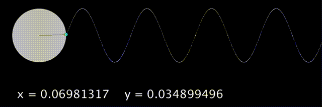
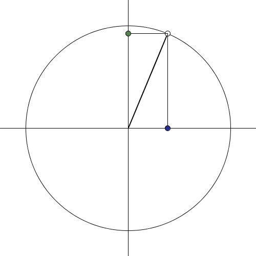

# 三角関数

三角関数とはなんでしょう。以下のプログラムを実行してみて下さい。内容が理解できなくても問題ありません。

```java
float radius = 75;
float frequency = 2;

float px, py;
float qx;
float angle;

void setup() {
  size(900, 300);
}

void draw() {
  background(0);

  // 円を描く
  noStroke();
  fill(255, 200);
  ellipse(width / 8, 100, radius * 2, radius * 2);

  // 円の周りを回る部分を描く
  float insetX = width / 8;
  px = radius * cos(radians(angle)) + insetX;
  py = radius * sin(radians(angle)) + 100;

  stroke(100);
  line(insetX, 100, px, py);

  fill(255, 255, 0);
  ellipse(px, py, 8, 8);

  // y = sin(x) のカーブを描く

  stroke(255);
  fill(255);
  float theta = 0;
  float end = width - insetX;
  for (int i = 0; i < end; i++) {
    float x = insetX + radius + i;
    float y = radius * sin(radians(theta)) + 100;
    point(x, y);
    theta -= frequency;
  }

  // 円の周りを回っている丸とsinカーブとの関係を描く
  float lx = insetX + radius + qx;
  noStroke();
  fill(0, 255, 255);
  ellipse(lx, py, 7, 7);

  stroke(255, 0, 255, 200);
  line(px, py, lx, py);

  angle -= frequency;
  qx += 1.0;

  // sinカーブの終端まで辿り着いたら始端に戻す
  if (width < lx) {
    qx = 0;
    angle = 0;
  }

  // 曲線のxとyの値を画面に表示する
  stroke(255);
  fill(255);
  textSize(32);

  float adjustedX = radians(-angle);
  float adjustedY = -(py - 100) / radius;
  text("x = " + adjustedX, 50, 275);
  text("y = " + adjustedY, 350, 275);
}
```

このプログラムは，三角関数の最も基本的な関数である **sin 関数**の振る舞いを表しています。`y`の値が-1 と 1 の間を行ったり来たりしていることがわかると思います。



## sin 関数

### sin 関数で大きさが変化する円

sin 関数を使った表現を学びましょう。まずは大きさが変わる円です。

```java
void setup() {
  size(500, 500);
}

void draw() {
  background(0);

  float theta = frameCount / 20.0;
  float y = sin(theta);

  float centerX = width / 2;
  float centerY = height / 2;
  float size = map(y, -1, 1, 0, min(width, height));

  fill(255);
  ellipse(centerX, centerY, size, size);
}
```

### sin 関数で背景色が変化する

背景色を sin 関数で変化させてみます。

```java
color color1 = color(253, 125, 22);
color color2 = color(4, 45, 135);

void setup() {
  size(500, 500);
}

void draw() {
  float theta = frameCount / 20.0;
  float y = sin(theta);
  color c = lerpColor(color1, color2, map(y, -1, 1, 0, 1));
  background(c);
}
```

## sin 関数と cos 関数

**cos 関数** も三角関数の最も基本的な関数のひとつです。sin 関数と cos 関数の関係をみてみるために，次のプログラムを実行してみて下さい。

```java
float radius = 200;

void setup() {
  size(500, 500);
}

void draw() {
  background(255);
  stroke(0);
  fill(255);

  float centerX = width / 2;
  float centerY = height / 2;
  circle(centerX, centerY, radius * 2);
  line(0, centerY, width, centerY); // X軸
  line(centerX, 0, centerX, height); // Y軸

  pushMatrix();
  translate(centerX, centerY);

  float theta = atan2(mouseY - centerY, mouseX - centerY);
  float x = radius * cos(theta);
  float y = radius * sin(theta);

  strokeWeight(2);
  line(0, 0, x, y);

  strokeWeight(1);
  circle(x, y, 10);
  line(x, y, 0, y);
  line(x, y, x, 0);

  // cos
  fill(#262E8E);
  circle(x, 0, 10);

  // sin
  fill(#55854E);
  circle(0, y, 10);

  popMatrix();
}
```

円周上の点（白丸）と真ん中の原点を結ぶ直線がなす角は，マウスの動きによって変化します。緑色と青色の点がそれぞれ sin 関数と cos 関数のふるまいです。



### 回転

```java
void setup() {
  size(500, 500);
}

void draw() {
  background(0);

  float centerX = width / 2;
  float centerY = height / 2;
  float length = min(width, height) / 2 - 20;

  float theta = frameCount / 40.0;

  float x = length * cos(theta) + centerX;
  float y = length * sin(theta) + centerY;

  fill(255);
  ellipse(x, y, 20, 20);
}
```

## 振り子（発展）

振り子のシミュレーションプログラムを書いてみましょう。

振り子の挙動は[こちら](https://en.wikipedia.org/wiki/Pendulum)を参考にして下さい。

```java
PVector origin = new PVector(250, 20);
float g = 9.8; // 重力加速度定数
float length = 300;
float angle = PI / 6; // 鉛直下向きを0とする
float velocity = 0;
float acceleration = 0;

void setup() {
  size(500, 500);
}

void draw() {
  background(255);

  // update
  acceleration = -1 * g / length * sin(angle);
  velocity += acceleration;
  angle += velocity;

  // render
  float x = length * sin(angle);
  float y = length * cos(angle);
  PVector pos = new PVector(x, y);
  pos.add(origin);

  line(width / 2, 0, pos.x, pos.y);
  ellipse(pos.x, pos.y, 50, 50);
}
```
