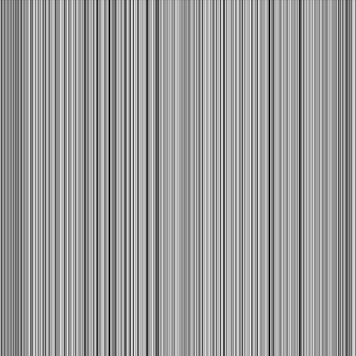
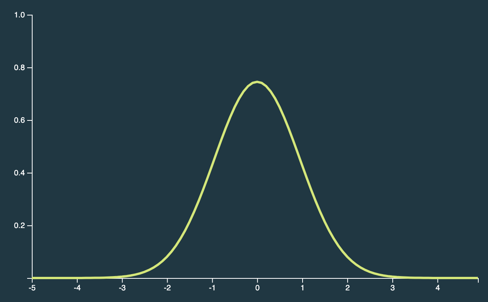
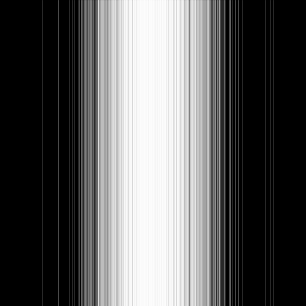
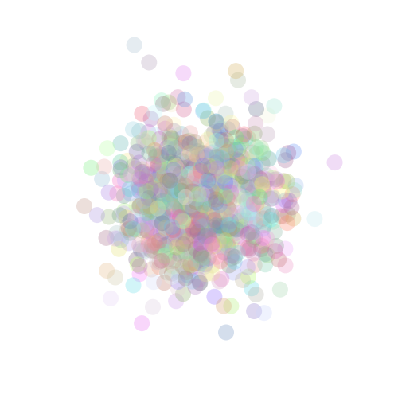
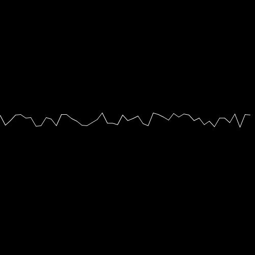
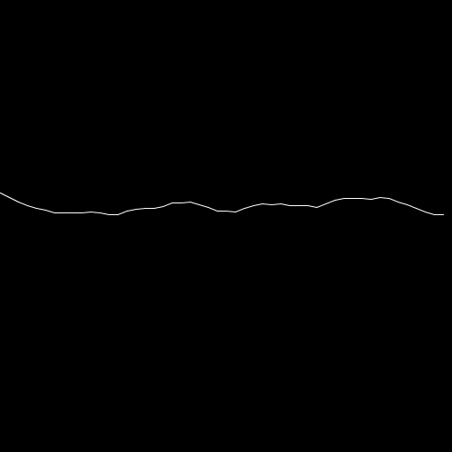
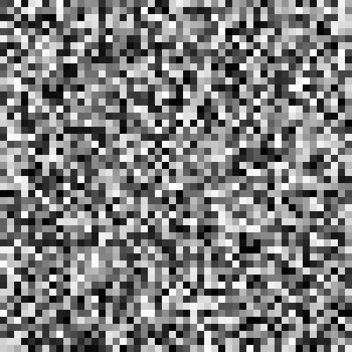
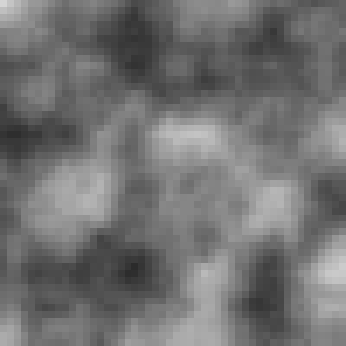

# ランダムとノイズ

## ランダム

私たちはこれまでに `random()` 関数を使ってランダムな数値を生成して扱ってきました。「ランダムな色の正方形をランダムな位置に描く」プログラムを以下に再掲します。

```java
// ランダムな色の正方形をランダムな位置に描く

void setup() {
  size(500, 500);
  noStroke();
  background(255, 255, 255);
}

void draw() {
  // ランダムな位置
  float x = random(width);
  float y = random(height);

  // ランダムな色
  float r = random(100, 255);
  float g = random(100, 255);
  float b = random(100, 255);
  fill(r, g, b, 80);

  square(x, y, 80);
}
```

`random()` 関数の振る舞いをもう少しみていきましょう。以下のプログラムを実行してみましょう。

```java
void setup() {
  size(500, 500);
  background(0);
  stroke(255, 255, 255, 40);
}

void draw() {
  float x = random(0, width);
  line(x, 0, x, height);
}
```

このプログラムは，X 軸状の点をランダムに選んで縦の線をひくプログラムです。線の色を半透明の白色にしているので，重ねて塗っていくと不透明の白に近づいていきます。



上図は実行結果の画像です。3000 本の線を描きました。

Processing には `random()` 以外にもランダムな値を生成する関数があります。[`randomGaussian()`](https://processing.org/reference/randomGaussian_.html) です。この関数は [**標準正規分布**](https://ja.wikipedia.org/wiki/%E6%AD%A3%E8%A6%8F%E5%88%86%E5%B8%83#%E6%A8%99%E6%BA%96%E6%AD%A3%E8%A6%8F%E5%88%86%E5%B8%83) に従う値を生成します。これを使うと，以下の図のように釣鐘型の分布に従う乱数を簡単につくることができます。（真ん中付近が起こりやすい。）



`randomGaussian()` の振る舞いを確認しています。

```java
void setup() {
  size(500, 500);
  background(0);
  stroke(255, 255, 255, 40);
}

void draw() {
  float centerX = width / 2;
  float e = width * 0.2;
  float x = centerX + e * randomGaussian();
  line(x, 0, x, height);
}
```



中央付近に線が引かれているのがわかります。

---

演習）冒頭の「ランダムな色、ランダムな位置に正方形を描く」プログラムを，**真ん中付近**に**円**を描くプログラムに変更してみましょう。



---

## ノイズ

Processing には `noise()` という関数があります。 `random()` や `randomGaussian()` との違いについてみていきましょう。

まず最初に，水平線をひきます。

```java
float px = 0.0;
float py = 0.0;

void setup() {
  size(500, 500);
  background(0);
  stroke(255);

  // 描画部分
  float centerY = height / 2;
  for (int x = 0; x < width; x += 10) {
    float y = centerY;
    if (x != 0) {
      line(px, py, x, y);
    }
    px = x;
    py = y;
  }
}
```

後からノイズを加えるので細かい線をつなげて一本の真っ直ぐな線を描いています。実行すると以下の画像のような結果になります。


次に，縦方向に少しずつずらして線を描いてみたいと思います。まずは `random()` 関数を使ってずらしてみます。`// 描画部分` の箇所を以下のように変更してみて下さい。

```java
// 描画部分
float centerY = height / 2;
for (int x = 0; x < width; x += 10) {
  float y = centerY - random(20);
  if (x != 0) {
    line(px, py, x, y);
  }
  px = x;
  py = y;
}
```



次は `noise()` 関数を使ってみます。以下のコードを実行して下さい。

```java
float noiseScale = 0.01;
float px = 0.0;
float py = 0.0;

void setup() {
  size(500, 500);
  background(0);
  stroke(255);

  // 描画部分
  float centerY = height / 2;
  for (int x = 0; x < width; x += 10) {
    float xoff = x * noiseScale;
    float y = centerY - 50 * noise(xoff);
    if (x != 0) {
      line(px, py, x, y);
    }
    px = x;
    py = y;
  }
}
```

以下の画像のような結果が得られるはずです。先ほどの `random()` を使った例よりも滑らかな線が引けたと思います。



`noise()` 関数で得られる値は，**「パーリンノイズ」** というノイズです。パーリンノイズは CG の世界では炎や煙を低コストで表現できる重要なノイズです。

パーリンノイズの振る舞いを直感的に理解できる例として，グリッドを描いてみます。（以前，for 文の説明をした際に用いたコードです。）

```java
void setup() {
  size(500, 500);

  float step = 10;

  for (float x = 0; x < width; x += step) {
    for (float y = 0; y < height; y += step) {
      square(x, y, step);
    }
  }
}
```

角マスをランダムな色で塗ってみます。ランダムな色で塗るには以下のコードを `square()` の直前に挿入しましょう。

```java
fill(random(255));
```



パーリンノイズを使うと，空間的にスムーズな変化をもたせることができます。試しに以下のプログラムを実行して下さい。

```java
void setup() {
  size(500, 500);

  float step = 10;
  float xOff = 0.0;
  float yOff = 0.0;
  float noiseScale = 0.1;

  for (float x = 0; x < width; x += step) {
    xOff += noiseScale;
    yOff = 0.0;
    for (float y = 0; y < height; y += step) {
      yOff += noiseScale;
      noStroke();
      fill(map(noise(xOff, yOff), 0, 1, 0, 255));
      square(x, y, step);
    }
  }
}
```



---

残りの時間はノイズで遊んでみましょう。
