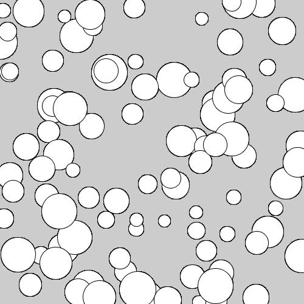

# 物体の動きをおさらい

## 変数

「変数」について学んだときのプログラムを再掲します。[\*](https://github.com/fuller-kport/hello-processing/blob/master/appendix/variable.md#%E5%AE%A3%E8%A8%80%E5%88%9D%E6%9C%9F%E5%8C%96%E4%BB%A3%E5%85%A5)

```java
float x = 0; // x を宣言して 0 で初期化
float y = 0; // y を宣言して 0 で初期化

void setup() {
  size(500, 500);

  x = 100; // x に 100 を代入
  y = 200; // y に 200 を代入
}

void draw() {
  circle(x, y, 80); // ここで x と y 使う
}
```

`x` と `y` の値を参照して円を描画していることがわかります。

次に `x` と `y` を時間と共に変化させてみます。

```java
float x = 0.0;
float y = 0.0;

void setup() {
  size(500, 500);
  x = 250; // x を中央にする
  y = 250; // y を中央にする
}

void draw() {
  background(255, 255, 255); // フレーム毎に白で塗りつぶす
  x = x + random(-1, 1); // x に -1から1の間の乱数を足す
  y = y + random(-1, 1); // y に -1から1の間の乱数を足す
  circle(x, y, 80);
}
```

フレーム毎に円がランダムな移動をするようになりました（ランダムウォーク）。

移動量を変数にしてみましょう。「1 フレームに移動する量」なので「速さ」として `vx` と `vy` をそれぞれ定義します。

```java
float x = 0.0;
float y = 0.0;
float vx = 1.0; // vx を宣言して 1 で初期化
float vy = 1.0; // vy を宣言して 1 で初期化

void setup() {
  size(500, 500);
  x = 250;
  y = 250;
}

void draw() {
  background(255, 255, 255);
  x = x + vx * random(-1, 1); // x に vx を掛けた乱数を足す
  y = y + vy * random(-1, 1); // x に vy を掛けた乱数を足す
  circle(x, y, 80);
}
```

`vx` と `vy` を変更して実行してみましょう。

ランダムウォームは面白いのですが，一定の速度で移動する円を描いてみましょう。

```java
float x = 0.0;
float y = 0.0;
float vx = 1.0;
float vy = 3.3;

void setup() {
  size(500, 500);
  fill(80);
}

void draw() {
  background(255, 255, 255);
  x = x + vx;
  y = y + vy;
  circle(x, y, 80);
}
```

### 境界条件

ウィンドウの外側へどこまでも進んでいってしまうので，はみ出した場合には反対側の位置になるように変更してみます（実行結果を見た方がわかりやすいです）。

```java
float x = 0.0;
float y = 0.0;
float vx = 1.0;
float vy = 3.3;

void setup() {
  size(500, 500);
  fill(80);
}

void draw() {
  background(255, 255, 255);
  x = x + vx;
  y = y + vy;

  if (x < 0.0) {
    x = width;
  }
  if (x > width) {
    x = 0.0;
  }
  if (y < 0.0) {
    y = height;
  }
  if (y > height) {
    y = 0.0;
  }

  circle(x, y, 80);
}
```

## ベクタ

次に [`PVector`](https://processing.org/reference/PVector.html) を使ってプログラムを書き換えてみます。

```java
PVector position = new PVector(0, 0);
PVector velocity = new PVector(1.0, 3.3);

void setup() {
  size(500, 500);
  fill(80);
}

void draw() {
  background(255, 255, 255);
  position.add(velocity);

  if (position.x < 0.0) {
    position.x = width;
  }
  if (position.x > width) {
    position.x = 0.0;
  }
  if (position.y < 0.0) {
    position.y = height;
  }
  if (position.y > height) {
    position.y = 0.0;
  }

  circle(position.x, position.y, 80);
}
```

境界条件の判定処理を関数にしてみます。 `checkBoundary()` という名前の関数を定義して処理を移動しましょう。

```java
PVector position = new PVector(0, 0);
PVector velocity = new PVector(1.0, 3.3);

void setup() {
  size(500, 500);
  fill(80);
}

void draw() {
  background(255, 255, 255);

  position.add(velocity);

  checkBoundary();

  circle(position.x, position.y, 80);
}

void checkBoundary() {
  if (position.x < 0.0) {
    position.x = width;
  }
  if (position.x > width) {
    position.x = 0.0;
  }
  if (position.y < 0.0) {
    position.y = height;
  }
  if (position.y > height) {
    position.y = 0.0;
  }
}
```

draw 関数がすっきりしてわかりやすくなりました。

## クラス

Processing には"**クラス**"があります。

`Ball` クラスを定義してみます。

```java
class Ball {
  float radius;
  float x;
  float y;
}
```

`x` と `y` は `Ball` クラスの**プロパティ**と呼びます（属性ともいいます）。

`Ball` クラスは次のように使用できます。

```java
Ball b = new Ball();

println(b.radius); // "0.0" と出力される。float 型の初期値は 0.0 になる。
println(b.x, b.y); // "0.0 0.0" と出力される。
```

ここでは `new Ball()` を実行することで，`Ball`クラスの値を生成しています（**インスタンス**をつくるともいいます）。

値を生成するときに，パラメータを指定することもできます。

```java
class Ball {
  float radius;
  float x;
  float y;

  Ball(float radius) {
    this.radius = radius;
  }
}
```

こうすると，以下のようにボールの半径を指定して値をつくることができます。値をつくるときに呼び出している特別な関数のことを「**コンストラクタ (constructor)**」と呼びます。

```java
Ball b = new Ball(20);

println(b.radius); // "20.0" と出力
```

ボールの位置を保持するプロパティ `x` と `y` を `PVector` で置き換えて，初期化時に指定できるようにしてみましょう。

```java
class Ball {
  PVector position;
  float radius;

  Ball(PVector position, float radius) {
    this.position = position;
    this.radius = radius;
  }
}
```

これは以下のように使用します。

```java
// 位置（10, 42）と半径15をもつボールを作成する
Ball b = new Ball(new PVector(10, 42), 15);
```

ボールを描画してみましょう。

```java
Ball b;

void setup() {
  size(500, 500);
  PVector p = new PVector(10, 42);
  b = new Ball(p, 15);
}

void draw() {
  circle(b.position.x, b.position.y, b.radius * 2);
}
```

クラスには「**メソッド**」と呼ばれる関数を追加することができます。`Ball` クラスに円を描画するための `render()` メソッドを追加してみます。

```java
class Ball {
  PVector position;
  float radius;

  Ball(PVector position, float radius) {
    this.position = position;
    this.radius = radius;
  }

  void render() {
    circle(position.x, position.y, radius * 2);
  }
}
```

`render()` を使って先ほどのプログラムを書き換えてみます。

```java
Ball b;

void setup() {
  size(500, 500);
  PVector p = new PVector(10, 42);
  b = new Ball(p, 15);
}

void draw() {
  b.render();
}
```

もちろん，複数のボールを生成して描画することもできます。

```java
Ball b1;
Ball b2;
Ball b3;

void setup() {
  size(500, 500);
  b1 = new Ball(new PVector(10, 42), 15);
  b2 = new Ball(new PVector(20, 5), 10);
  b3 = new Ball(new PVector(14, 9), 12);
}

void draw() {
  b1.render();
  b2.render();
  b3.render();
}
```

## もっとたくさんのボール

複数の値の列を管理する一般的な方法に，「**配列**」があります。

```java
// 要素数が3の整数配列
int[] numbers = new int[3];

println(numbers[0]); // "0" と出力。整数配列は0で初期化される。
println(numbers[1]); // "0" と出力
println(numbers[2]); // "0" と出力
```

配列は for 文を使って操作します。

```java
// 要素数が100の整数配列
int[] numbers = new int[100];

// 配列の全ての要素にインデックスと同じ数字を代入
for (int i = 0; i < numbers.length; i++) {
  numbers[i] = i;
}

println(numbers[42]); // "42" と出力
```

では，先ほどの `Ball` クラスの配列を作ってみましょう。

```java
Ball[] balls = new Ball[3];

println(balls[0]); // "null" と出力。クラスの配列はnullで初期化される。
println(balls[1]); // "null" と出力
println(balls[2]); // "null" と出力
```

クラスの配列は `null` で初期化されています。

100 個のボールをランダムな位置で初期化して描画してみます。

```java
Ball[] balls = new Ball[100];

void setup() {
  size(500, 500);

  for (int i = 0; i < balls.length; i++) {
    float x = random(0, width);
    float y = random(0, height);
    PVector p = new PVector(x, y);
    float r = random(10, 50);
    balls[i] = new Ball(p, r);
  }
}

void draw() {
  for (int i = 0; i <  balls.length; i++) {
    balls[i].render();
  }
}
```



---

- **演習 1**： `Ball` クラスに速度ベクトルを追加して 100 個のボールを動かしてみましょう。
- **演習 2**： `Ball` クラスに位置の更新を行う `update()` メソッドを追加してみましょう。
- **演習 3**： ランダムな位置，ランダムな半径を持つボールを作成する関数 `createRandomBall()` 関数を追加してみましょう。

```java
class Ball {
  PVector position;
  PVector velocity;
  float radius;

  Ball(PVector position, PVector velocity, float radius) {
    this.position = position;
    this.velocity = velocity;
    this.radius = radius;
  }
}
```

ここまでの完全なプログラムを以下に掲載します。

**Ball**

```java
class Ball {
  PVector position;
  PVector velocity;
  float radius;

  Ball(PVector position, PVector velocity, float radius) {
    this.position = position;
    this.velocity = velocity;
    this.radius = radius;
  }

  void update() {
    position.add(velocity);
  }

  void render() {
    circle(position.x, position.y, radius * 2);
  }
}
```

**sketch**

```java
Ball[] balls = new Ball[100];

void setup() {
  size(500, 500);

  for (int i = 0; i < balls.length; i++) {
    balls[i] = createRandomBall();
  }
}

void draw() {
  background(255);

  for (int i = 0; i <  balls.length; i++) {
    Ball b = balls[i];
    b.update();
    b.render();
  }
}

Ball createRandomBall() {
  float x = random(0, width);
  float y = random(0, height);
  float vx = random(-1, 1);
  float vy = random(-1, 1);
  PVector p = new PVector(x, y);
  PVector v = new PVector(vx, vy);
  float r = random(10, 30);
  return new Ball(p, v, r);
}
```
