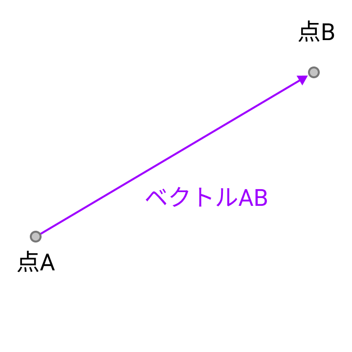

# ベクター



これは点 A から点 B にかけて矢印を書いた図です。この矢印を**ベクトル**呼びます。

「ベクトル」という言葉は色々なところで耳にすると思いますが、私たちがこれから扱うのは「ユークリッド空間のベクトル」です。つまりは上の図の矢印のことです。

## 座標とベクトル

以下のプログラムを実行して下さい。

```java
float x = 0.0;
float y = 0.0;
float vx = 1.0;
float vy = 3.3;

void setup() {
  size(500, 500);
  fill(80);
}

void draw() {
  if (x > width || x < 0) {
    vx = -1 * vx;
  }
  if (y > height || y < 0) {
    vy = -1 * vy;
  }

  background(255, 255, 255);
  x = x + vx;
  y = y + vy;
  circle(x, y, 80);
}
```


ソースコードを読んで動きを理解して下さい。 `x` と `y` がボールの **座標ベクトル**， `vx` と `vy` は **速度ベクトル**です。

実は Processing は [`PVector`](https://processing.org/reference/PVector.html) というベクトルを表現する方法を提供しています。

これを使うと，先ほどのプログラムは以下のように書き換えることができます。

```java
PVector location = new PVector(0, 0);
PVector velocity = new PVector(1.0, 3.3);

void setup() {
  size(500, 500);
  fill(80);
}

void draw() {
  background(255, 255, 255);
  location.add(velocity);

  if (location.x > width || location.x < 0) {
    velocity.x = -1 * velocity.x;
  }
  if (location.y > height || location.y < 0) {
    velocity.y = -1 * velocity.y;
  }

  circle(location.x, location.y, 80);
}
```
